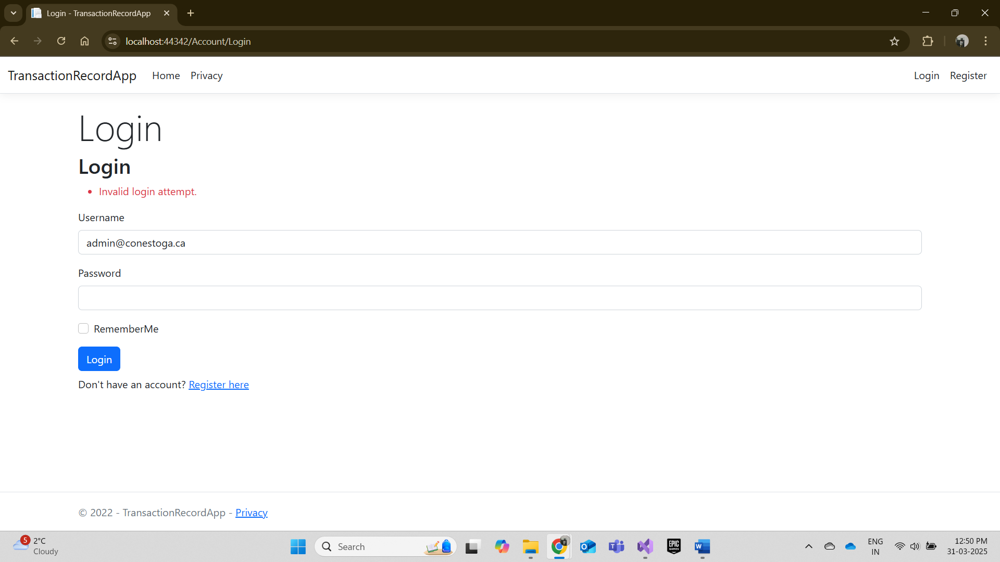
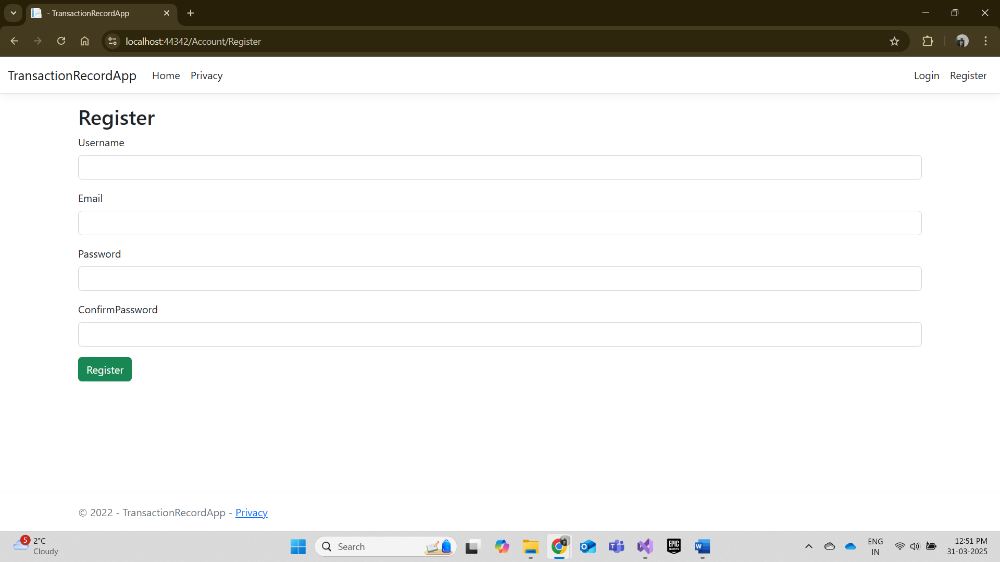
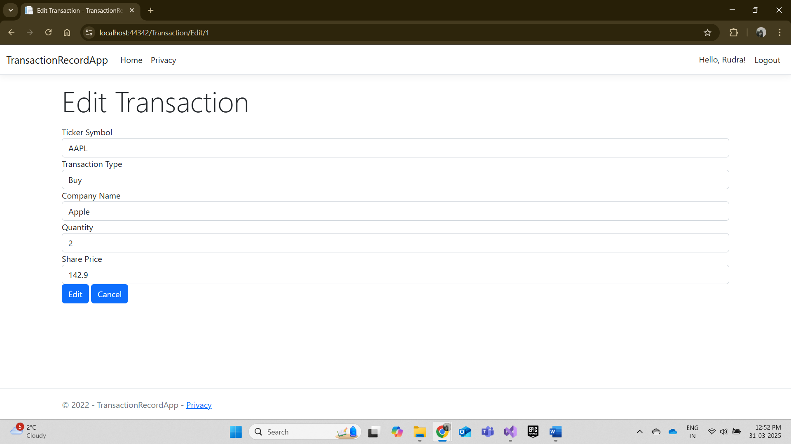
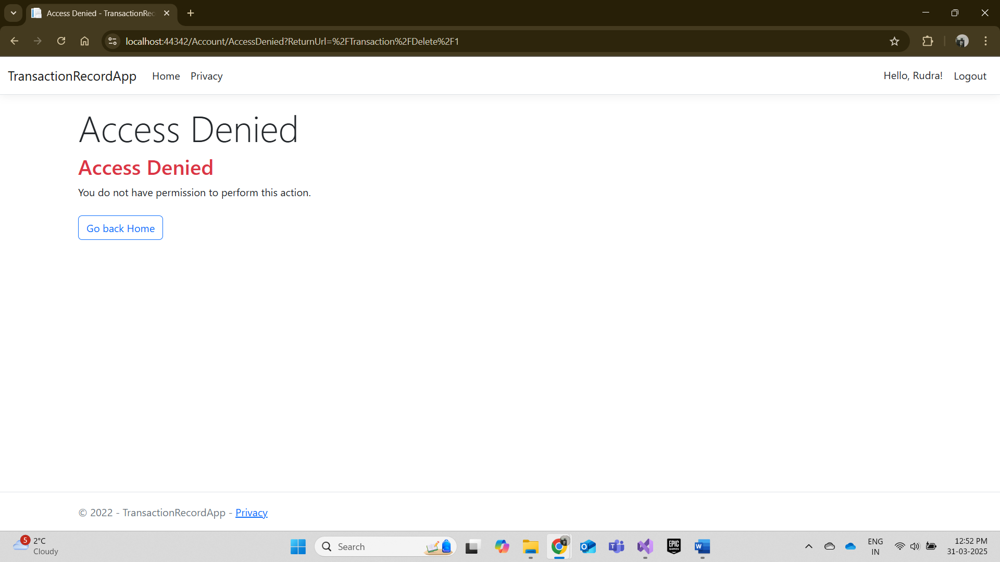
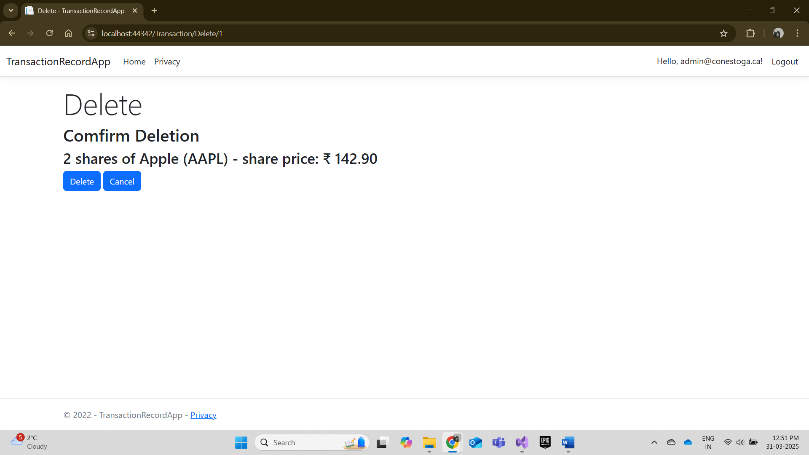

# TransactionRecordApp – README

## Overview
This is an ASP.NET Core MVC application that tracks stock transactions (buying and selling) with role-based authorization. Only authenticated users can add or edit transactions, and only the Admin role can delete them.

## Setup & Installation

1. **Clone or Download** the repository to your local machine.

2. **Open the Solution**:  
   - Open `TransactionRecordApp.sln` in Visual Studio (or another .NET-compatible IDE).

3. **Update the Connection String**:  
   - In `appsettings.json`, locate `"TransactionsDb"` under `"ConnectionStrings"` and ensure it matches your local database server setup.  
   - Example:
     ```json
     "ConnectionStrings": {
       "TransactionsDb": "Server=(localdb)\\MSSQLLocalDB;Database=Transactions8831198;Trusted_Connection=True;"
     }
     ```

4. **Install NuGet Packages (if needed)**:  
   - Make sure **Microsoft.EntityFrameworkCore**, **Microsoft.EntityFrameworkCore.SqlServer**, **Microsoft.AspNetCore.Identity.EntityFrameworkCore**, and **Microsoft.EntityFrameworkCore.Tools** are installed. Visual Studio usually restores them automatically.

5. **Add & Update the Database**:  
   - Open **Package Manager Console** in Visual Studio.
   - Run:
     ```powershell
     Add-Migration InitialCreate
     Update-Database
     ```
   - This creates or updates the local SQL database with the Identity tables and the seeded transaction data.

6. **Run the Application**:  
   - Press **F5** in Visual Studio to run in debug mode, or
   - Use `dotnet run` in a terminal/command prompt.

7. **Test the Admin User**:
   - On first run, an Admin role and user may be seeded automatically in `TransactionContext.CreateAdminUser(...)` or in `Program.cs`.
   - Default admin credentials might be:
     - Username: `admin`
     - Password: `Pa$$w0rd123`
   - You can update these in code if needed.

## How It Works

- **Register**: Create a new user account with username, email, and password.
- **Login**: Once logged in, you can add or edit transactions.
- **Delete**: Only an **Admin** can delete a transaction. Regular users see an Access Denied page if they try to delete.
- **Transaction Pages**: 
  - **Index** shows a list of existing transactions.
  - **Add** (or **Edit**) requires you to be authenticated.
  - **Delete** requires you to be both authenticated and in the Admin role.

## Screenshots

1. **Login Page**  
   

2. **Register Page**  
   

3. **Edit Transaction**  
   

4. **Access Denied**  
   

5. **Delete Transaction**  
   


## Notes & Tips

- **Password Requirements**: By default, ASP.NET Identity requires a minimum length of 6 and other complexity rules (uppercase, lowercase, digit, etc.).
- If you see `_ValidationScriptsPartial` or jQuery 404 errors, check that your `/lib` folder has the right paths for **jquery.validate** and **jquery.validate.unobtrusive**. Then ensure references in `_Layout.cshtml` or `_ValidationScriptsPartial.cshtml` match those paths.
- Admin can be changed or re-seeded in your code where `CreateAdminUser(...)` is defined.  

---

**Enjoy exploring the TransactionRecordApp!**
